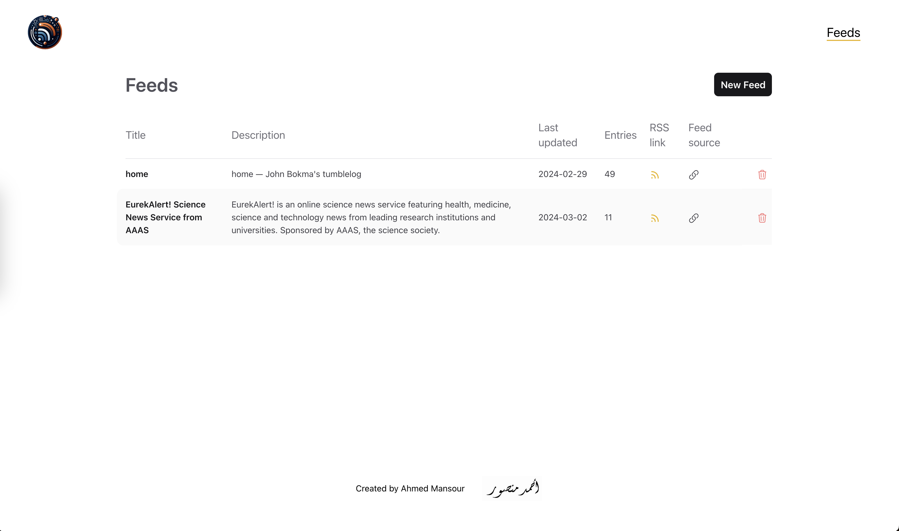
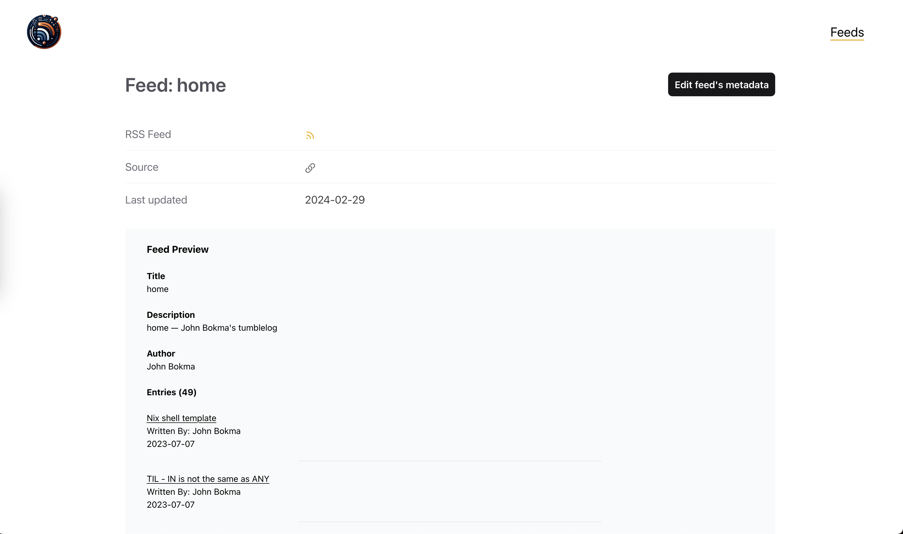
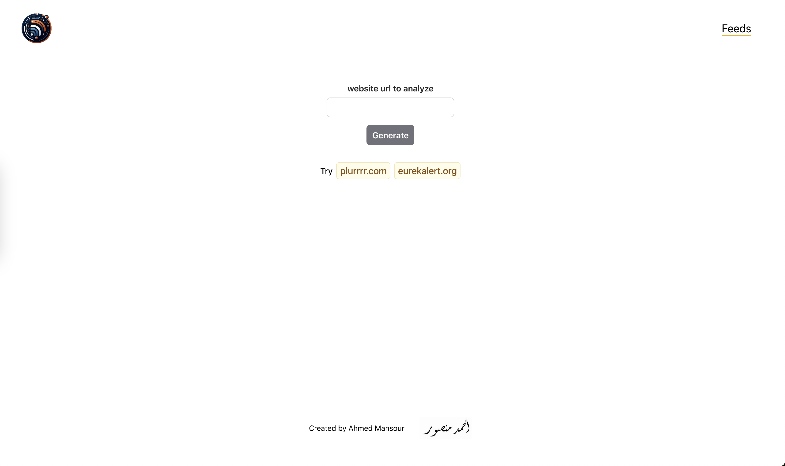
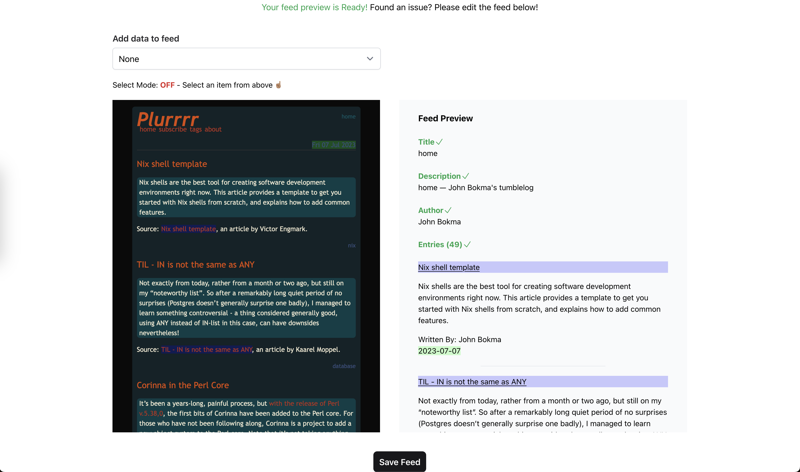
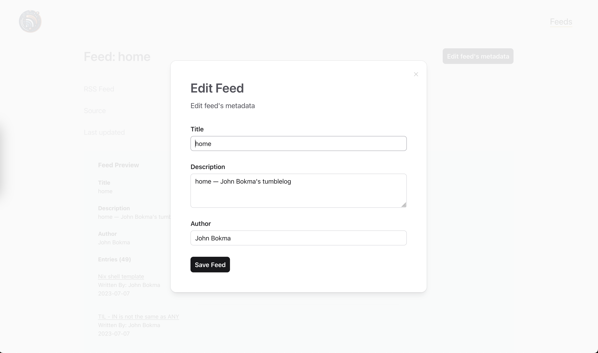
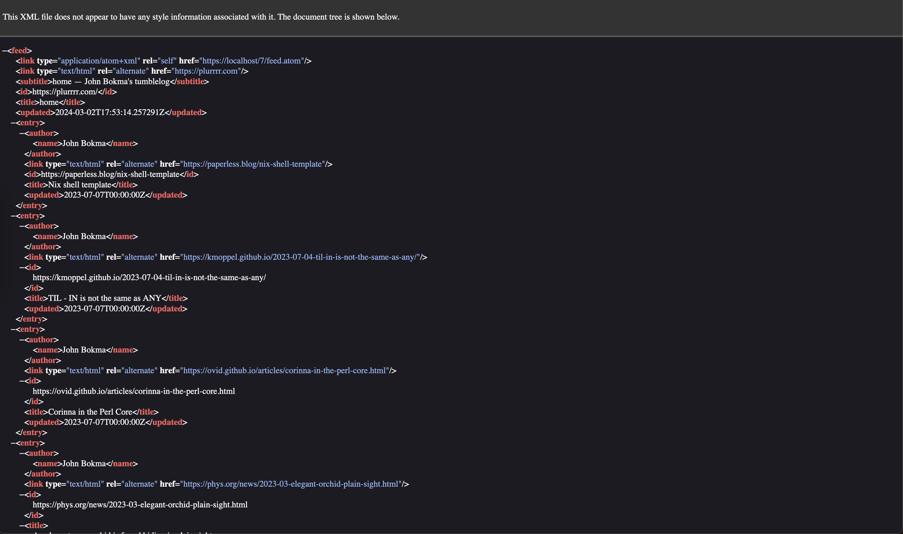

# RssAutoGenerator

The demo for the application is available [here](https://rss-auto-generator.fly.dev/)

## Introduction

A web application designed to enable the creation of RSS feeds for websites lacking native RSS support.

The app utilizes OpenAI's APIs to automate the analysis of web content, facilitating the generation of RSS feeds. Users can also manually select elements from a website to include in the feed.

Once created, the application provides an Atom RSS feed URL for consumption through the user's preferred RSS reader.

### Used technologies

- Elixir
- Phoenix
- TailwindCSS
- PostgreSQL
- Docker
- OpenAI

## Running the App

Clone the repository and navigate to the project directory:

```bash
git clone https://github.com/mansour-ahmed/rss_feed_generator
cd rss_feed_generator
```

### With Elixir

If you have Elixir installed, you can run the app directly on your machine.

1. Start the PostgreSQL service:

```bash
docker-compose up postgres -d
```

2. Install the dependencies:

```bash
mix deps.get
```

3. Create and migrate the database:

```bash
mix ecto.setup
```

4. Set environment variables:

```bash
cp .example.env .env
```

Now, edit the .env file with the correct values.


5. Start the Phoenix server:

```bash
source .env && mix phx.server
```

The app's UI will be accessible at `http://localhost:4000`.

## Tests & Code Quality

The app has **49** tests. To run the tests using Elixir: `mix test`.

The app also includes the code quality tools:

- Sobelow: security-focused static analysis.
- Credo: static code quality analysis.
- mix_audit: scan Mix dependencies for security vulnerabilities.
- Dialyxir: to enable Erlang's Dialyzer.

To run all of the above: `mix check`.

## Directory structure

The app uses a standard Phoenix directory structure. For more details, refer to the [Phoenix documentation](https://hexdocs.pm/phoenix/directory_structure.html).


## Frontend UI

### Landing Page


- Path: `/`

### Feeds Page



- Path: `/feeds`

### Feed Page



- Path: `/feeds/:id`

### New Feed Page




- Path: `/feeds/new`

### Feed Edit Page



- Path: `/feeds/:id/edit`

### Atom Feed Page



- Path: `/:id/feed.atom`

## Future development ideas

- Support for JavaScript-Heavy Applications.
- Addition of a daily cron job to update feed content.
- Automatic RSS Feed Detection when website already has an existing RSS feed.
- Extended Feed Fields Support.
- More Advanced Feed Editing Capabilities.
- Improved Validation to Prevent Duplicates
- Security Enhancements for iframes
- User Authentication and Personalization

## License

MIT
